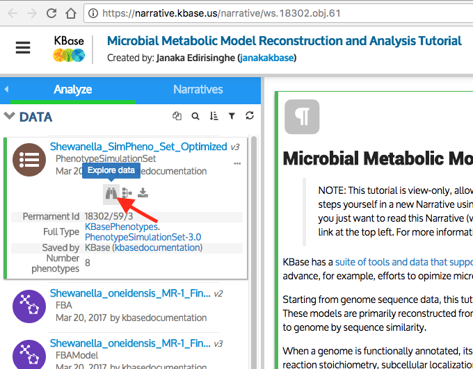
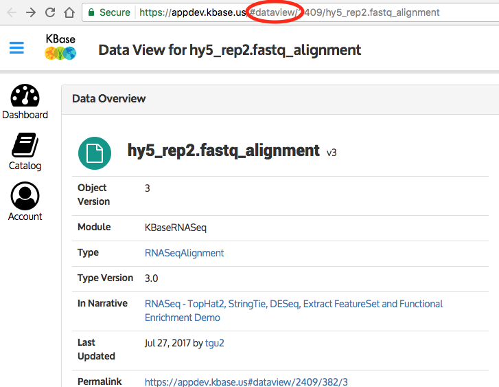
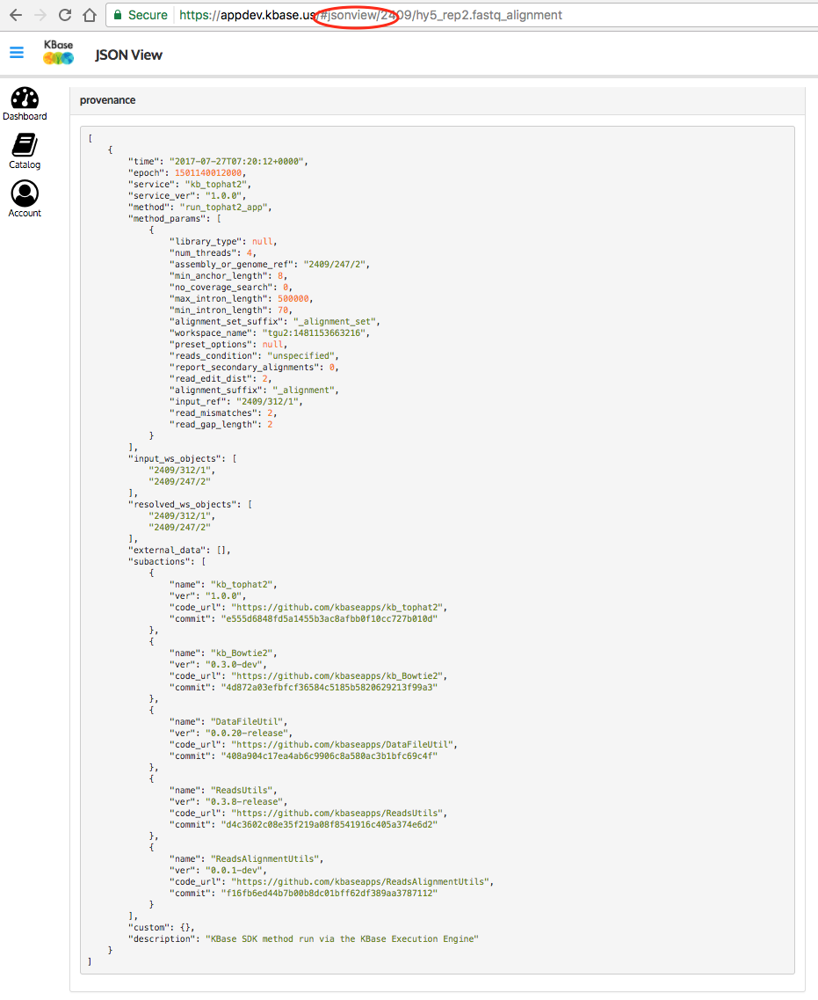
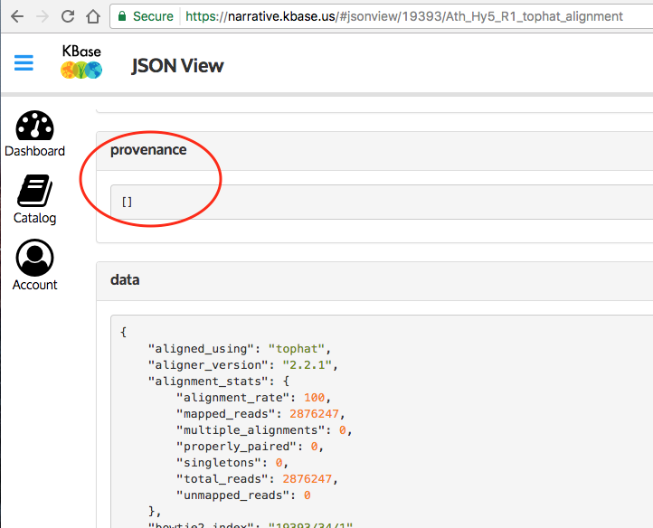

# Checking Provenance

The provenance system is an core part of KBase's value as a scientific platform, consequently it is important that provenance information be properly stored.

A basic guideline for getting provenance right is to make use of the [DataFileUtils](https://narrative.kbase.us/#catalog/modules/DataFileUtil) module to handle input and output of objects/files. This utility module handles properly generating the [provenance objects](https://ci.kbase.us/services/ws/docs/Workspace.html#typedefWorkspace.ProvenanceAction) in a workspace object that are used to track provenance.

For any given object in KBase, it is possible to see the detailed provenance information for an object by first selecting an object from the narrative data panel, and clicking on the "Explore Data" icon:

The page the comes up is the landing page for the object, with a URL that has "#dataview" as the first part of the path:

Edit the "dataview" portion to "jsonview" instead in order to see the details of the object as a JSON dump, to expose the detailed contents of the provenance action object(s):

The above example shows an object with a fairly complete set of provenance information. Here is an example of an object produced by an app with *unacceptable* provenance data:

This example above with empty provenance was produced by an old version of the tophat application that did not use the DataFileUtils module, the fully populated provenance object was produced by a newer version of tophat that had been converted to use DataFileUtils.
