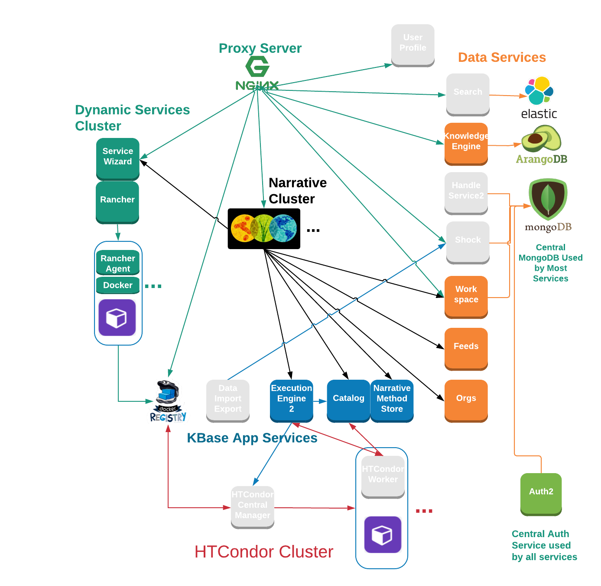
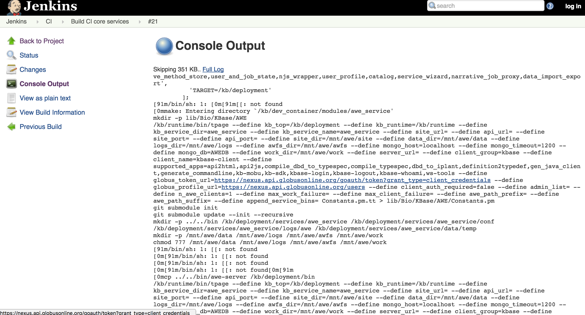
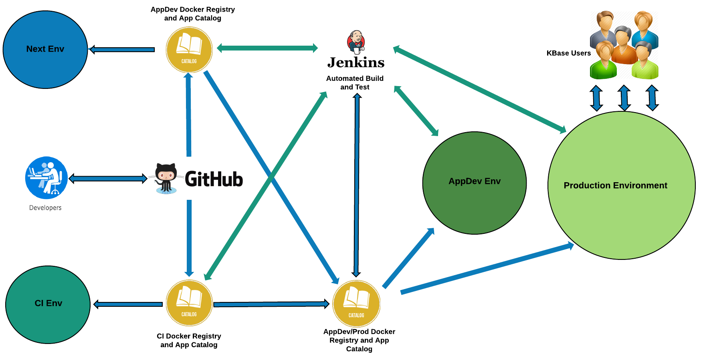
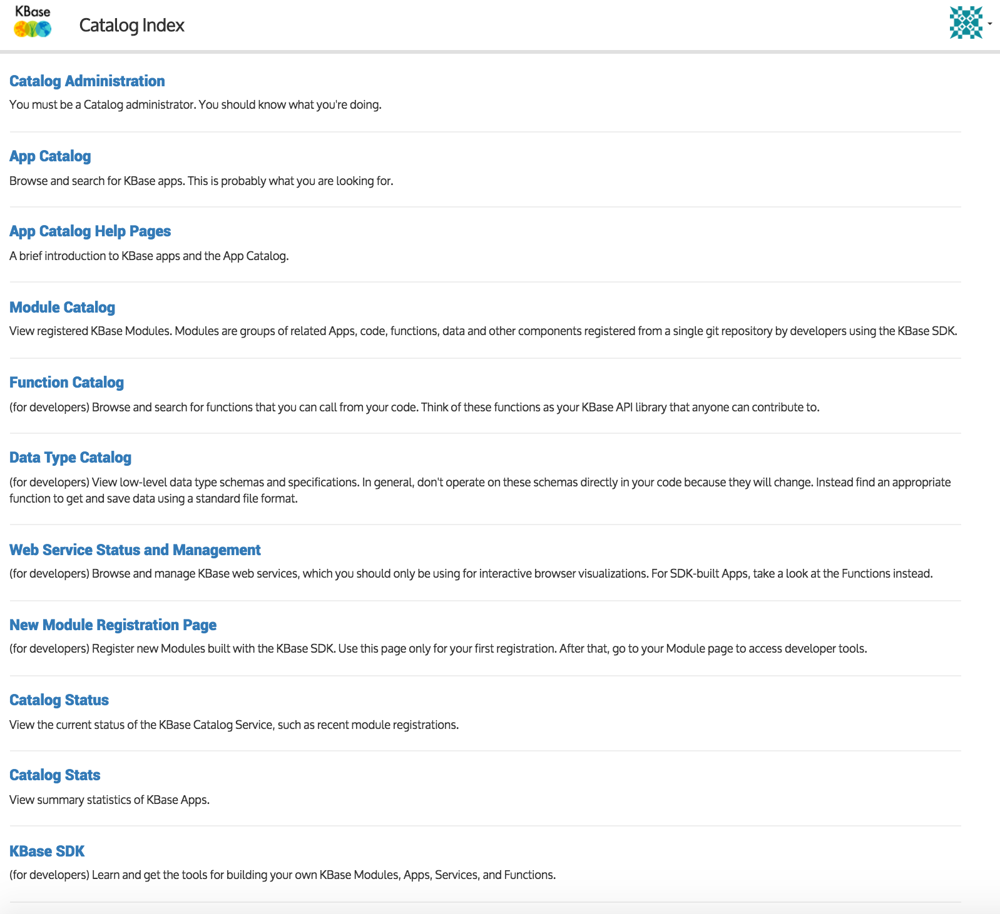

# KBaseDeveloperBootstrap
This repo contains a tutorial intended to help a developer who is new to KBase learn the
architecture, conventions and basic APIs and services well enough to become a productive developer
on the platform.

# Table of Contents
1. [Introduction](#introduction)
1. [Architecture and Core Services](#architecture-and-core-services)
1. [Development Environments](#development-environments)
1. [Code Requirements and Guidelines](#code-requirements-and-guidelines)
1. [KBase SDK](#kbase-sdk)
1. [Working with the SDK](#working-with-the-sdk)
1. [Data Services](#data-services)
1. [Front End](#front-end)
1. [Testing](#testing)

## Introduction

This repository is intended to be a How To for new developers to KBase, that walks them through the
background information necessary to be a confident and productive contributor to the KBase project.
This intended to be a living document - if you have updates or extensions, please fork it and the submit
a pull request.

## Architecture and Core Services

   There are several major categories to the KBase applications architecture:
   * The KBase Narrative
   * KBase Applications Services (SDK)
   * KBase Dynamic Services
   * KBase Data Services
   * Execution Engine (AWE)
   * Authentication and User Profile

   Note that this does not include the Wordpress based website. The relationships
between the service categories is somewhat complex, but ongoing work will simplify
the architecture over time. The following diagram is current as of the beginning of 2017.

## Development Environments

This section discusses both the local development environment being used by the developer on their
personal workstation, as well as the different environments (production, continuous integration, etc...)
within the KBase service.

### The Local Development Environment

In order to develop code for KBase API services and the Narrative, the following packages need to be
installed on the development host:

* [git tools](https://git-scm.com/doc), [minimally the command line tools](https://git-scm.com/downloads)
* support for [Docker](https://www.docker.com/)
* [Java 1.7+](https://java.com/en/download/)
* [Python 2.7+](https://www.python.org/)
* [Python virtualenv](http://docs.python-guide.org/en/latest/dev/virtualenvs/)
* a reasonably current [NodeJS](https://nodejs.org/en/) installation
* [Bower](https://bower.io/)
* [Xcode](https://itunes.apple.com/us/app/xcode/id497799835?mt=12) ( for MacOS only )
* A suitable code editor [see our recommendations below](#integrated-development-environment)

We assume that the developer is familiar with git, and especially the common [github workflows](https://guides.github.com/introduction/flow/),
as the [KBase source code is all kept in Github](https://github.com/kbase). Changes to existing KBase
code is handled by branching and then submitting pull requests, using the conventional Github workflow.
For core KBase services, *development should not occur on the master branch*.

### Docker

MacOS developers the recommended setup is to use [Docker for Mac](https://docs.docker.com/docker-for-mac/),
this bundles up all the dependencies for running a Docker environment into a single installer. We recommend using
the "stable" version.

Recent version of Windows also [support docker]( https://docs.docker.com/docker-for-windows/ )

[Most current releases of Linux Distros either include Docker or allow it to be installed](https://docs.docker.com/engine/installation/linux/) provided that you have administrative privileges.

These are the direct links for Redhat and Ubuntu:

https://docs.docker.com/engine/installation/linux/rhel/

https://docs.docker.com/engine/installation/linux/ubuntulinux/

### Integrated Development Environment

IDEs provide significant benefits for developers in terms of code checking and style enforcement. KBase
promotes the use of lightweight IDEs for developers who are not currently using an IDE, and for developers
who are already using an IDE, we recommend code validation tools and standard configurations.

[This document](https://github.com/kbase/project_guides/blob/master/RecommendedEditors.md) describes
the recommended editors and configurations. Briefly, Atom, Visual Studio Code and Sublime are recommended,
with the emphasis on Atom and VS Code because they are entirely free, whereas Sublime implements "nagware"
until the user purchases a license.

Python code contributed to KBase should conform to PEP8 guidelines and also pass the flake8+putty configuration described this
[tox.ini file](https://github.com/kbase/kb_sdk/blob/develop/tox.ini). Atom, VS Code and CI platforms such
as Travis CI have support for tox.ini files, centralizing configuration.

### Production, CI, Next, AppDev Environments

Currently ( 12/2016 ) KBase operates 4 environments in its overall service, each environment has
its own set of services, with disjunct collections of narratives and data:

* Production - the environment where KBase users run their applications and store their data.
the main entrypoint for this environment is narrative.kbase.us for narratives, and the main web service
endpoint is via kbase.us

* Continuous Integration (CI) - this environment is intended for rapidly deploying developer SDK apps into
a full environment with Narrative, Auth, Data Services, Execution engines, etc... It is primarily for
the use of developers when they are ready to integrate their SDK apps into the KBase framework. The
endpoint for Narrative is ci.kbase.us whereas the endpoint for API services is ci.kbase.us/services

* Next - this was originally created as an environment for testing the core KBase platform, such as
the Narrative, Data Services, Auth, etc... this was originally motivated by a structural difference
in build and deployment for these core services vs SDK apps. As of 12/2016, the build and deployment
models for the core services and SDK apps have been consolidated. Next is likely to be retired in the
near future, and the integration testing of core services rolled into the CI environment. The entrypoints
are next.kbase.us and next.kbase.us/services/ for narratives and API services respectively.

* AppDev - this is intended as a merge point between the CI environment (for developer apps) and the Next
environment (for core KBase services) to ensure that developer apps integrate properly with changes to
the core platform. This is the last environment for testing/validation before release into production.
The entrypoints are appdev.kbase.us and appdev.kbase.us/services.

Each of these environments has their own set of service endpoints, and for the most part they have
distinct collections of narratives, workspaces, personal datasets, sample data, etc... and there are
not currently convenient procedures for migrating narratives and data from environment to environment.
Configuring apps and services to run in each environment is generally handled via a lookup table for
each service. An example configuration file ( extracted from the narrative repo )
[can be found here](sample_files/config.json).

The following JSON fragment from that file provides metadata about the overall configuration file, sets
the current environment to "appdev" via the _"config": "appdev"_  line and declares the endpoints for
the AppDev environment, with a dictionary identifying the set of endpoints for AppDev, each endpoint
keyed on the service name with the value set to the API endpoint.

~~~JSON
{
    "config": "appdev",
    "name": "KBase Narrative",
    "version": "3.1.0-alpha-4",
    "dev_mode": true,
    "git_commit_hash": "60e2219",
    "git_commit_time": "Thu Mar 3 15:44:21 2016 -0800",
    "features": {
        "advanced": false,
        "developer": false
    },
    "release_notes": "https://github.com/kbase/narrative/blob/staging/RELEASE_NOTES.md",
    "tooltip": {
        "hideDelay": 0,
        "showDelay": 750
    },
    "use_local_widgets": true,
    "loading_gif": "/narrative/static/kbase/images/ajax-loader.gif",
    "appdev": {
        "ftp_api_url": "https://appdev.kbase.us/services/kb-ftp-api/v0",
        "ftp_api_root": "/data/bulk",
        "awe": "https://appdev.kbase.us/services/awe-api",
        "catalog": "https://appdev.kbase.us/services/catalog",
        "cdn": "https://appdev.kbase.us/cdn/files",
        "data_import_export": "https://appdev.kbase.us/services/data_import_export",
        "data_panel_sources": "/data_source_config.json",
        "fba": "https://appdev.kbase.us/services/KBaseFBAModeling/",
        "feature_values": "https://appdev.kbase.us/services/feature_values/jsonrpc",
        "gene_families": "https://appdev.kbase.us/services/gene_families",
        "genomeCmp": "https://appdev.kbase.us/services/genome_comparison/jsonrpc",
        "job_service": "https://appdev.kbase.us/services/njs_wrapper",
        "landing_pages": "/#dataview/",
        "log_proxy_host": "172.17.42.1",
        "log_proxy_port": 32001,

~~~

Releases into each of these environments is currently being converted into Jenkins jobs, with the
goal of making all release procedures triggered via Jenkins. Here is a sample console from the task
that builds and releases the core CI services.

This diagram is current as of Feb 2017 and shows an abstracted view of the relationships between
the environments and Jenkins.

## Code Requirements And Guidelines

A [previously linked document](https://github.com/kbase/project_guides/blob/master/RecommendedEditors.md) contains some
requirements for coding standards - please review it.
[Code Reviews](https://github.com/kbase/project_guides/blob/master/CodeReviews.md) are required
for all code added to the KBase system.

[This presentation](https://docs.google.com/presentation/d/1_SrBxGbWU53UNn2sM6KhR2fsbywjjxi2qn3mtloU81A/edit#slide=id.p)
 covers some coding best practices specific to KBase.

## KBase SDK

The KBase SDK is fairly well documented in the [README document in Github](https://github.com/kbase/kb_sdk)
In addition, Mike Sneddon has a [detailed architecture slide deck](https://docs.google.com/presentation/d/18hxRC5enjA6kF-Ezn9xWdZ5xr2tg2c6LxBQXPxQ_5ik/edit?usp=sharing) that provides an overview of the SDK architecture.

### The App Catalog

If you visit the App Catalog interface, there is a lot of useful information about the state of apps:
https://narrative.kbase.us/#catalog

### The Narrative spec.json file

The Google Doc that describes the Narrative UI Specification file can be found here:
[https://docs.google.com/document/d/1CZ1GOKsRr1NsScG9E2EesJyk_ViOrM9OazrVFKCkyHs/edit?usp=sharing](https://docs.google.com/document/d/1CZ1GOKsRr1NsScG9E2EesJyk_ViOrM9OazrVFKCkyHs/edit?usp=sharing)

For archival purposes, there is a PDF snapshot of the document [included in this repo](sample_files/NarrativeUIMethodSpecification.pdf).
This local copy is likely to be out of date at the time the reader looks at it, but may be useful in case the Google Doc is unavailable.

The following code fragment is an example from the Megahit repo and has some annotation using Javascript comments "//" inline.
A large portion of the file has been removed so that the "behavior" property can be focused on - this controls the interaction
between the front end form fields displayed in Narrative App Cells, and the backend API call. Sections that have been deleted
are noted with elipses "..."

~~~
{
	"ver": "1.0.4",
	
	"authors": [
		"msneddon"
	],
	"contact": "http://kbase.us/contact-us/",
	"visible": true,
	"categories": ["active","assembly","communities"],
	"widgets": {
		"input": null,
		"output": "no-display"
	},

    ...

	"behavior": { 
		"service-mapping": { // This is the main attribute you will use
			"url": "",
			"name": "MEGAHIT",
			"method": "run_megahit", // This definition is for the run_megahit function in the KIDL file
			"input_mapping": [ // Mapping between input form fields to the parameters in the KIDL spec
				{
					"narrative_system_variable": "workspace", // Internal value/variable in narrative
					"target_property": "workspace_name" // the workspace where this app is being run
				},
				{
					"input_parameter": "read_library_ref", // Form field on the app input form
          			"target_property": "read_library_ref", // destination property from the KIDL spec
          			"target_type_transform": "resolved-ref" // "resolved-ref" converts from textual name to numeric wsid
				},
				{
					"input_parameter": "output_contigset_name",
          				"target_property": "output_contigset_name"
				},
    ...
			],
			"output_mapping": [ //map from output object from KIDL to UI fields
                                // if there is a declaration with "input_parameter"
                                // this will just copy from the input box to the output field
				{
					"narrative_system_variable": "workspace",
					"target_property": "workspace_name"
				},
				{
					"service_method_output_path": [0,"report_name"], // use the first object returned and grab the "report_name" field
					"target_property": "report_name"
				},
				{
					"service_method_output_path": [0,"report_ref"],
					"target_property": "report_ref"
				},
				{
					"constant_value": "16",
					"target_property": "report_window_line_height"
				}
			]
		}
	},
	"job_id_output_field": "docker"
}
~~~~

### Dynamic Services and Rancher

The dynamic services infrastructure uses Rancher under the covers, the entrypoint for Rancher
documentation is [https://docs.rancher.com/rancher/v1.0/en/](https://docs.rancher.com/rancher/v1.0/en/)

Understanding Rancher is not entirely necessary for KBase App developers, however at some point
KBase may have the Rancher configurations packaged to the point where developers can spin up a
private KBase instance entirely on their local machine via Rancher.

## Working with the SDK

   The layout of a KBase SDK App is described in
[this document](https://github.com/kbase/kb_sdk/blob/master/doc/module_overview.md).

### Building A self-contained SDK App: ContigFilter

The ContigFilter application is provided as an example project within the KB_SDK, [walking through
the example](https://github.com/kbase/kb_sdk/blob/master/doc/tutorial/overview.md) is an excellent intro to SDK development.

### Additional guides and documentation

Also see the list of **[How-to Articles](https://github.com/kbase/kb_sdk/#how-to-articles)** and [additional documentation](https://github.com/kbase/kb_sdk/#additional-documentation) from the `kb_sdk` readme.

## Data Services

| Service | Best available documentation | Github repo |
|---|---|---|
| Workspace | [Links for ci / next / etc. docs](https://github.com/kbase/workspace_deluxe#getting-documentation) | [Repo](https://github.com/kbase/workspace_deluxe) |
| Shock | [Docs](https://github.com/MG-RAST/Shock/wiki) | [Repo](https://github.com/MG-RAST/Shock/) |
| Handle Service | [KIDL spec](https://github.com/kbase/handle_service/blob/master/handle_service.spec) | [Repo](https://github.com/kbase/handle_service/) |
| Handle Manager | [KIDL spec](https://github.com/kbase/handle_mngr/blob/master/handle_mngr.spec) | [Repo](https://github.com/kbase/handle_mngr/) |

## Front End

### Narrative

### KBase-UI

## Testing
